## 💻 Analysis-of-the-effectiveness-of-advertising-channels-and-marketing-campaigns

#### 🧾 Dataset used: "marketing_campaign_dataset" from Kaggle.

#### 📜 Objective
Understand which promotion channels bring in the most sales, what is the cost of customer acquisition (CAC) and return on investment (ROI) in advertising.

---

#### 🔨 Tools & Technologies
- Python (Pandas, Numpy, Matplotlib, Seaborn)
- ANOVA, STL, sklearn, LinearRegression, StandardScaler, KMeans
- Jupyter Notebook

---

#### 🎯 Key Findings
1. Top 10 Most Profitable Campaigns
 
| Campaign_ID | Campaign_Type | Profit |
| --- | --- | --- |
| 13019 | Influencer | 159456.36 |
| 33606 | Email | 159368.58 |
| 72530 | Display | 159360.00 |
| 13708 | Display | 159352.62 |
| 73095 | Influencer | 159352.18 |
| 8281 | Social Media | 159328.68 |
| 163709 | Display | 159248.69 |
| 11708 | Display | 159073.32 |
| 172561 | Search | 158809.96 |
| 70216 | Influencer | 158672.96 |

2. A/B testing
   - *Result: Campaign_Type: F = 0.41, p = 0.8031*
   - *Channel_Used: F = 1.53, p = 0.1776*
   - *There is no difference in profitability between campaigns and channels.*

3. The graph and the result of the test ANOVA (Target_Audience: F = 0.57, p = 0.6847) show that there is no difference in the influence of the target audience on CAC.

4. Time dynamics of advertising channel indicators
   - *CAC: Gradual increase since June.*
   - *ROI: Seasonal growth in April and August to December.*
   - *Conversion Rate: Fall in April and rise from August (probably during holiday periods).*

5. Seasonality
   - *CAC: There has been a gradual increase since May. Trend: up (0.97)*
   - *ROI and Conversion Rate: No significant growth is observed. Trend: (0.00)* 

6. By campaign type, Effective campaigns are 15.3% more effective than Average campaigns and 18.2% more effective than Ineffective campaigns. All companies have similar results.

---

#### 💡 Recommendations
- Focus budget across all channels during holiday periods for maximum ROI.
- Increase your use of video ads on Facebook and YouTube.
- Segment the target audience and develop individual strategies for young people and older generations.
- Reduce investment in used channels if CAC remains high.
- Monitor the dynamics of indicators monthly to identify new trends.

---

#### 🎨 Visualizations
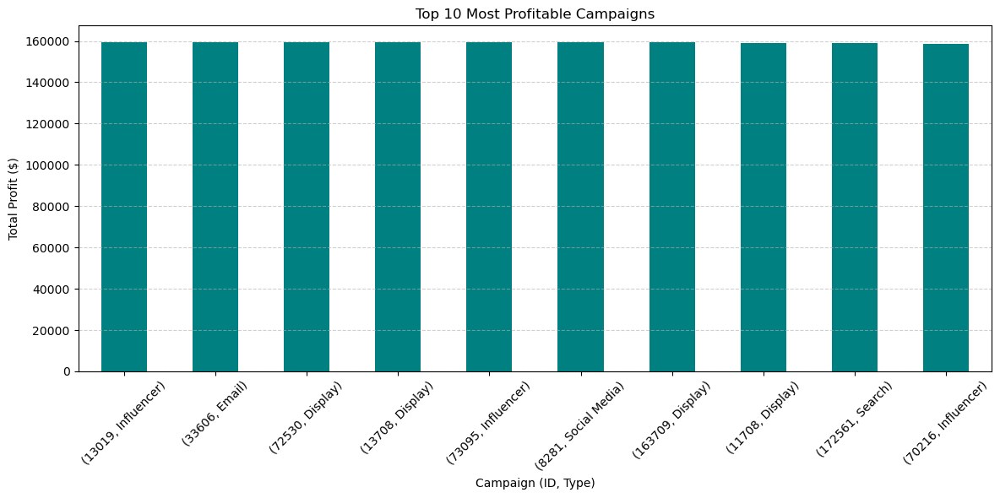
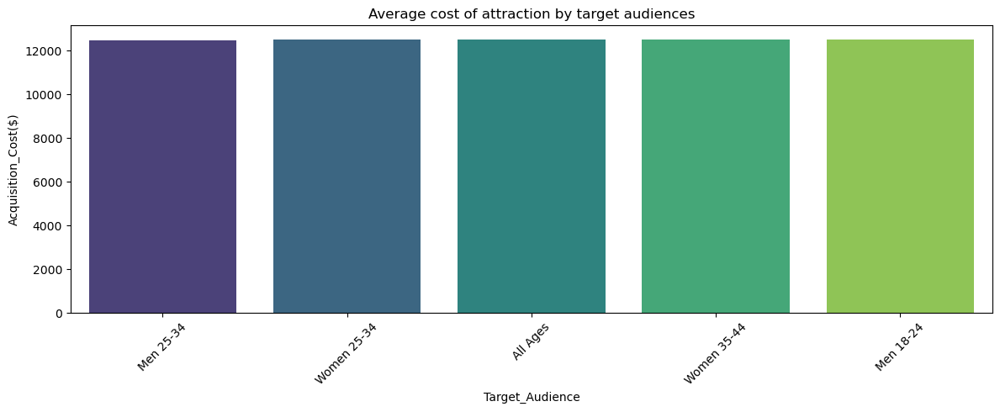
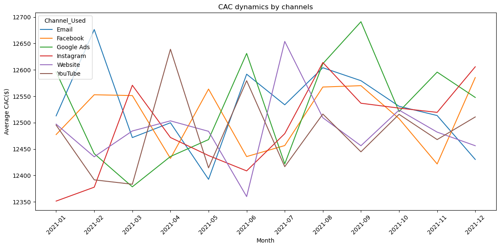
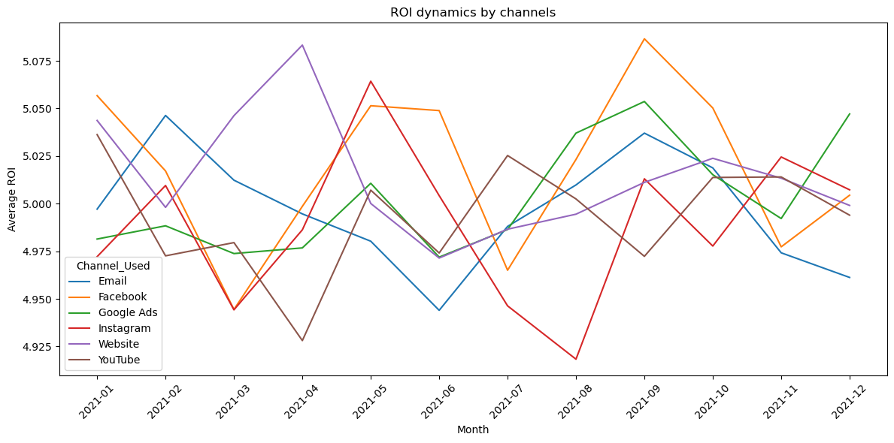
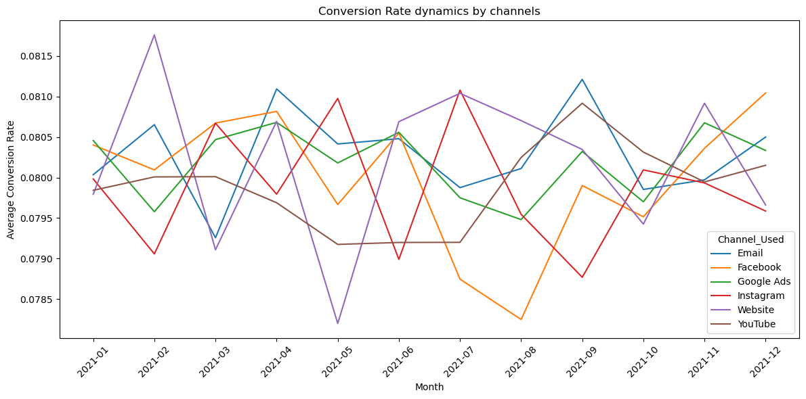
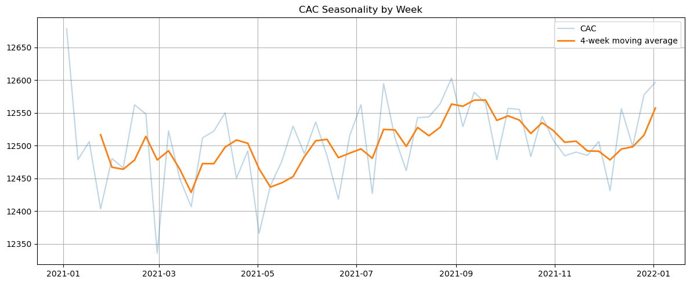
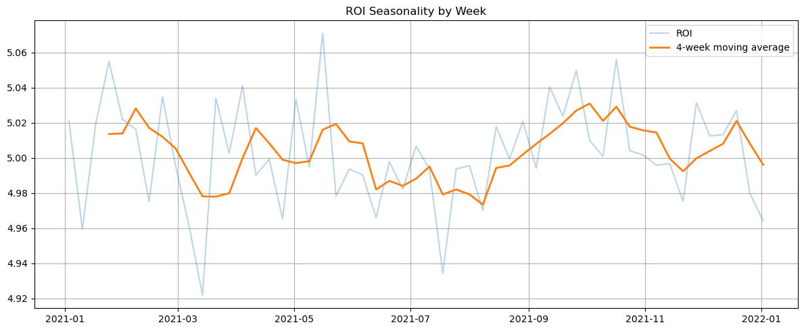
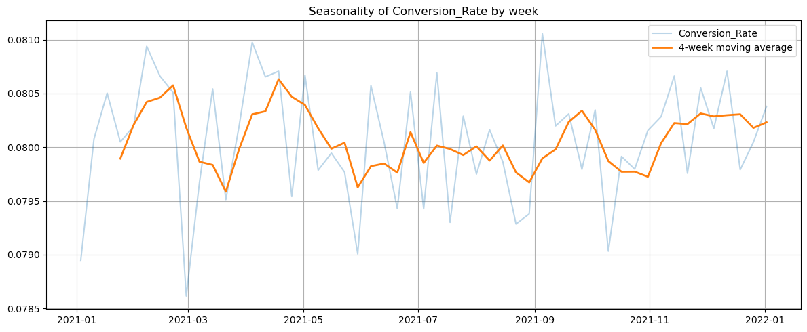
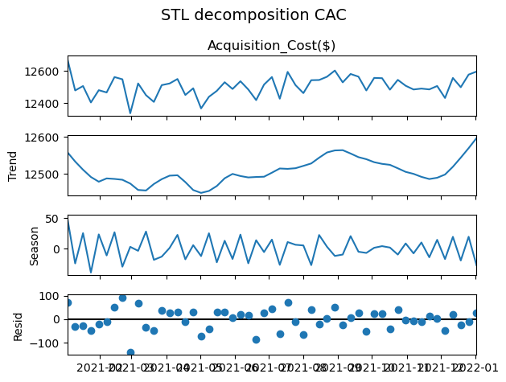
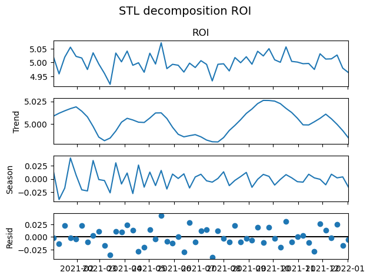
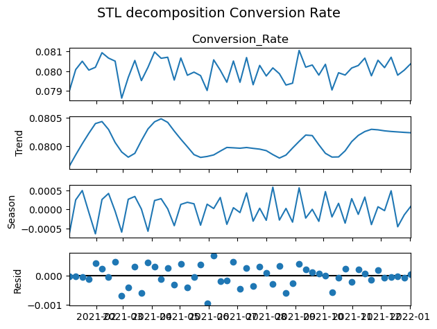

---

#### 😎💻 About Me
Hi, my name is Zhasulan Agybay and this is my fourth data analysis project. Check out my other projects on [GitHub](https://github.com/Zhasulan-Agybay).

---

#### ⚖️ License
This project is licensed under the MIT License. See the [LICENSE](./LICENSE) file for details.
